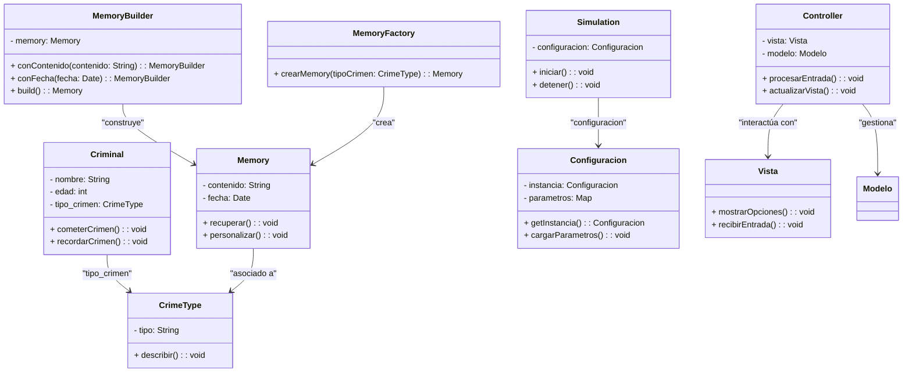

<pre>

	

Tecnológico Nacional de México
Instituto Tecnológico de Tijuana

Departamento de Sistemas y Computación
Ingeniería en Sistemas Computacionales

Semestre:
Agosto - Diciembre 2024

Materia:
Patrones de Diseño

Docente:
M.C. Rene Solis Reyes 

Bloque:
2

Título del trabajo:
 Cognify

Estudiante:
Sanchez Rosas Karime Lizbeth
Paez Beltra David

	

</pre>

## Objetivos del Proyecto

Rehabilitación Eficiente: Transformar las experiencias de los delincuentes mediante recuerdos artificiales diseñados para fomentar la empatía y el arrepentimiento.
Reducción de Costos: Minimizar los costos asociados con el encarcelamiento tradicional, como la construcción y mantenimiento de prisiones.
Reinserción Social: Permitir una reintegración rápida y efectiva de los criminales rehabilitados a la sociedad.
Innovación en Justicia Penal: Proporcionar una alternativa ética y tecnológica al castigo convencional, centrada en el aprendizaje y la rehabilitación.

## Diagrama UML

## Análisis del impacto social y técnico del sistema.

## Video LOOM
