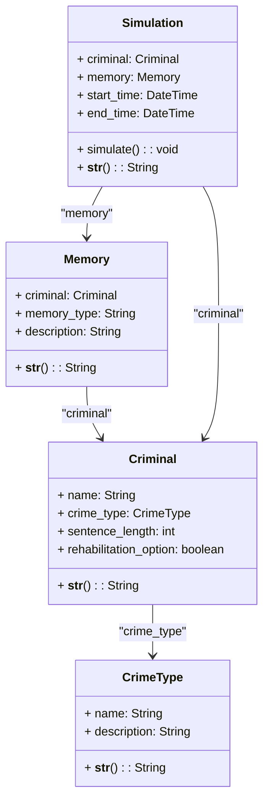

<pre>

	

Tecnológico Nacional de México
Instituto Tecnológico de Tijuana

Departamento de Sistemas y Computación
Ingeniería en Sistemas Computacionales

Semestre:
Agosto - Diciembre 2024

Materia:
Patrones de Diseño

Docente:
M.C. Rene Solis Reyes 

Bloque:
2

Título del trabajo:
 Cognify

Estudiante:
Sanchez Rosas Karime Lizbeth
Paez Beltra David
Luna Hernandez Harim

	

</pre>

## Objetivos del Proyecto

1. **Rehabilitación Eficiente**: Transformar las experiencias de los delincuentes mediante recuerdos artificiales diseñados para fomentar la empatía y el arrepentimiento.
2. **Reducción de Costos**: Minimizar los costos asociados con el encarcelamiento tradicional, como la construcción y mantenimiento de prisiones.
3. **Reinserción Social**: Permitir una reintegración rápida y efectiva de los criminales rehabilitados a la sociedad.
4. **Innovación en Justicia Penal**: Proporcionar una alternativa ética y tecnológica al castigo convencional, centrada en el aprendizaje y la rehabilitación.

## Diagrama UML

# Análisis del impacto social y técnico del sistema.

## 1. Contexto Social

La delincuencia y la rehabilitación de criminales son temas complejos que afectan a diversas comunidades. La forma en que la sociedad aborda la delincuencia puede influir en la seguridad pública, la cohesión social y la percepción de la justicia. En muchas ocasiones, los sistemas penitenciarios tradicionales han sido criticados por su enfoque punitivo y por no ofrecer oportunidades efectivas de rehabilitación. Esto ha llevado a un aumento en la reincidencia delictiva, lo que a su vez genera costos económicos y sociales significativos.

## 2. Necesidad de Innovación en Justicia Penal

El enfoque tradicional de encarcelamiento ha demostrado ser ineficaz en muchos casos. La implementación de programas de rehabilitación que se centran en la transformación personal y la reintegración social es esencial. En este sentido, el programa propuesto, que utiliza recuerdos artificiales diseñados para fomentar la empatía y el arrepentimiento, representa una innovación significativa en el ámbito de la justicia penal.

## 3. Análisis del Programa

### 3.1. Rehabilitación Eficiente

El programa busca transformar las experiencias de los delincuentes a través de recuerdos artificiales. Este enfoque tiene el potencial de crear un impacto emocional profundo, permitiendo que los delincuentes comprendan el daño causado a las víctimas y a la sociedad. Al fomentar la empatía, se espera que los individuos desarrollen una mayor conciencia de sus acciones y, en consecuencia, un deseo genuino de cambiar.

### 3.2. Reducción de Costos

La propuesta también aborda la necesidad de reducir los costos asociados con el encarcelamiento. Al ofrecer una alternativa que se centra en la rehabilitación en lugar de la reclusión, se pueden minimizar los gastos relacionados con la construcción y mantenimiento de prisiones. Esto no solo beneficiaría a los gobiernos y sistemas penitenciarios, sino que también podría liberar recursos para invertir en programas de prevención del delito y apoyo a las comunidades.

### 3.3. Reinserción Social

El programa tiene como objetivo facilitar una reintegración efectiva de los criminales rehabilitados en la sociedad. Al trabajar en la transformación personal y en la creación de un sentido de responsabilidad, se espera que los individuos puedan reintegrarse de manera más efectiva, reduciendo así el riesgo de reincidencia. Esto también puede contribuir a la cohesión social, ya que los exdelincuentes se convierten en miembros productivos de la comunidad.

### 3.4. Innovación en Justicia Penal

La propuesta representa un cambio hacia un enfoque más ético y humano en el sistema de justicia penal. Al centrarse en el aprendizaje y la rehabilitación, en lugar del castigo, se está promoviendo un modelo que puede ser más efectivo a largo plazo. Esto podría inspirar a otros sistemas de justicia a adoptar enfoques similares, fomentando un cambio cultural en la forma en que se percibe y se trata la delincuencia.

## 4. Desafíos y Consideraciones

A pesar de los beneficios potenciales, el programa también enfrenta desafíos. La implementación de recuerdos artificiales plantea cuestiones éticas y técnicas. Es fundamental asegurar que estos recuerdos no sean manipulativos o dañinos, y que se utilicen de manera responsable. Además, es necesario contar con el apoyo de profesionales en psicología y rehabilitación para garantizar que el proceso sea efectivo y seguro.

## 5. Conclusión

El análisis social del programa revela que, si se implementa de manera adecuada, tiene el potencial de transformar la forma en que se aborda la delincuencia y la rehabilitación en la sociedad. Al centrarse en la empatía, la reducción de costos y la reinserción social, se puede crear un sistema de justicia penal más justo y efectivo. Sin embargo, es crucial abordar los desafíos éticos y prácticos para garantizar que el programa cumpla con sus objetivos sin comprometer la integridad de los individuos involucrados.

## Video LOOM

## Asciinema
https://asciinema.org/a/3k5LgeYswmBI6EaFWcqzYqi2h
